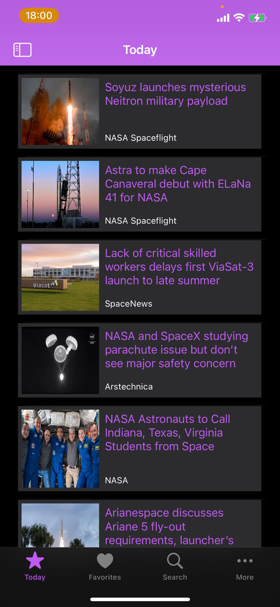
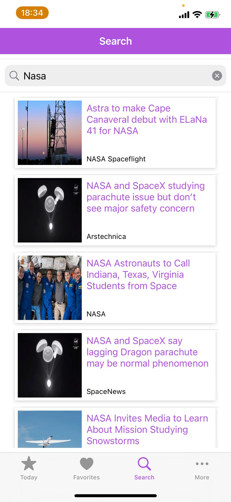

# Space Flight News

This is an iOS application developed in Swift that allows users to access news and information about the aerospace field. The app utilizes an API to provide updated data on rocket launches, space missions, astronomical discoveries, and more.

## Features

- Real-time visualization of aerospace news.
- View each article for complete details.
- Mark an article as a favorite for easy access later (stored in Firebase).
- Share articles on social media.
- Comment on articles for interactive discussions.
- Receive notifications when a new comment is added to an article.
- Search for articles using keywords or categories.
- View comments on each article.
- View a listing of related blog posts.
- View a list of reports on aerospace news.
- View your list of favorite articles for quick reference.
- View the QR Code associated with each article.
- Scan the QR Code directly from the app.
- Access the application settings for customization.
- Supports both light and dark mode, depending on the device settings.

## Mockups

  

    Homepage
  

  #### Shows a list of the most recent articles with their respective photo, title, and author. The sidebar menu allows navigation to articles, reports, and blog posts.

  Dark             |  Light
  :-------------------------:|:-------------------------:
   | 
   | 

  

    Article Details
  

  ### Shows the photo of the article, title, description, author, date and time of publication, option to add the article to favorites, option to generate QR Code for the article, share the article on social networks and comments section.

  Dark             |  Light
  :-------------------------:|:-------------------------:
   | 
   | 
   | 
   | 

 

  

    Reports & Blogs
  

  ### Shows a list of the most recent reports/blogs with their respective photo, title, and author.

  Dark             |  Light
  :-------------------------:|:-------------------------:
   | 
   | 

  

    Report & Blog Details
  

  ### Shows the photo of the report/post, title, description, author, date and time of publication, option to add the report/post to favorites, option to generate QR Code for the report/post and share the report/post on social networks.

  Dark             |  Light
  :-------------------------:|:-------------------------:
   | 
   | 

  

    Favorites
  

  ### Shows a list of favorite articles, reports or posts. shows its respective photo, title and author.

  Dark             |  Light
  :-------------------------:|:-------------------------:
   | 

  

    Search
  

  ### Shows a list of articles, reports or posts from the search result. shows its respective photo, title and author.

  Dark             |  Light
  :-------------------------:|:-------------------------:
   | 

  

    Settings
  

  ### Offers a plethora of customization options, including displaying the application version, access to privacy policies, FAQ, and contact information. Users can easily toggle application notifications, define cache validity periods, and choose between dark or light mode. Additionally, users have the flexibility to adjust the font size of the article titles to suit their preferences.

  Dark             |  Light
  :-------------------------:|:-------------------------:
    | 
   | 

## How to Use

1. Upon opening the app, you'll be greeted with a list of aerospace news.
2. Tap on any news to view more details.
3. In the article detail view, you can mark the article as a favorite, share it, comment on it, or scan the associated QR Code.
4. Use the search bar to find specific news by keyword.
5. Access the list of related blog posts or available reports for more information.
6. Visit your favorites list to see the articles you've saved for quick access.
7. Access the application settings to customize your experience.

## 🤝 Contributors
Made with ☕ and 💜 by:

<table>
  <tr>
    <td align="center">
      <a href="https://github.com/heyliceeee">
         
        
          <b>Alice Dias</b>
        
      </a>
    </td>
    <td align="center">
      <a href="https://github.com/Falphir">
         
        
          <b>Tiago Costa</b>
        
      </a>
    </td>
  </tr>
</table>

